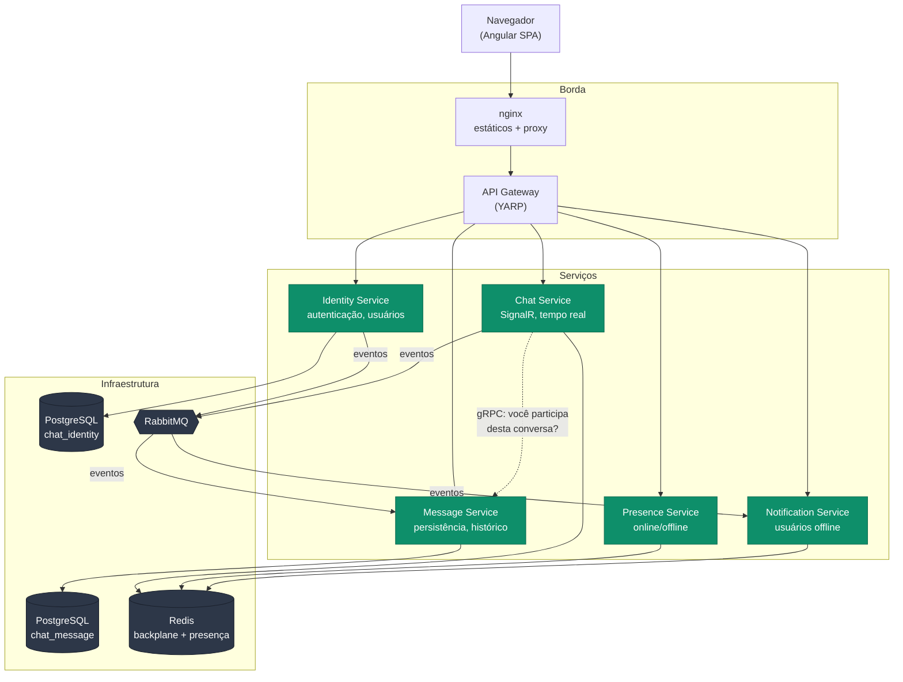
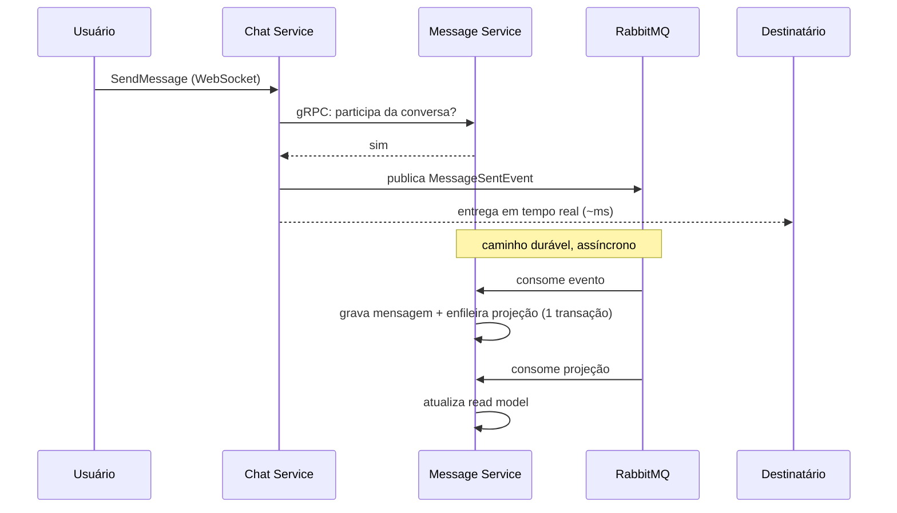

# Distributed Chat Platform

Plataforma de chat distribuída em **.NET 10** e **Angular 19**, construída com Clean Architecture, CQRS,
mensageria orientada a eventos e comunicação em tempo real via SignalR.

[Arquitetura](#arquitetura) · [Como rodar](#como-rodar) · [Decisões técnicas](#decisões-técnicas) ·
[Segurança](#segurança) · [Testes](#testes) · [Limitações conhecidas](#limitações-conhecidas)

| | |
|---|---|
| **Backend** | .NET 10, C# 14, ASP.NET Core, EF Core 10, MediatR, FluentValidation, MassTransit |
| **Frontend** | Angular 19 (standalone, signals, lazy loading), SignalR client |
| **Dados** | PostgreSQL 17 (×2, um por serviço), Redis 7 |
| **Mensageria** | RabbitMQ 4 com outbox, inbox, retry exponencial, circuit breaker e DLQ |
| **Tempo real** | SignalR com backplane Redis |
| **Entre serviços** | gRPC (autorização síncrona) + eventos AMQP (propagação assíncrona) |
| **Observabilidade** | OpenTelemetry (traces + métricas), Prometheus, Grafana |
| **Infra** | Docker Compose, Kubernetes (k3s), GitHub Actions |
| **Testes** | 133 testes de backend (xUnit, NSubstitute, Shouldly) + 15 de frontend (Karma/Jasmine) |

---

## Arquitetura

### Visão geral



### O caminho de uma mensagem

O ponto mais interessante da arquitetura é que enviar uma mensagem percorre **dois caminhos
simultâneos**, com garantias diferentes:



- **Caminho rápido** (SignalR): entrega em milissegundos, volátil.
- **Caminho durável** (RabbitMQ → PostgreSQL): consolida o histórico em segundo plano.

O usuário vê a mensagem instantaneamente; a durabilidade chega logo em seguida. É a razão de a
consistência eventual ser aceitável aqui — e não seria, por exemplo, num saldo bancário.

### Camadas

Cada serviço segue Clean Architecture, com a **regra de dependência apontando para dentro**:

```
API ──────► Infrastructure ──────► Application ──────► Domain
(HTTP,        (EF Core, Redis,      (casos de uso,      (entidades,
 SignalR,      RabbitMQ, gRPC)       abstrações)         invariantes)
 gRPC)                │                    ▲
                      └──── implementa ────┘
```

Na prática: a lógica de "cadastrar usuário" não sabe que existe PostgreSQL. As interfaces
(`IUserRepository`, `IConversationAccessPolicy`) são declaradas na camada de aplicação e
implementadas na de infraestrutura.

**Organização por fatia vertical.** Dentro de cada camada de aplicação, o código é agrupado por caso
de uso, não por tipo técnico:

```
Application/
  Abstractions/          IUserRepository, IPasswordHasher, ITokenService…
  Contracts/             DTOs e mapeamentos
  Users/
    RegisterUser.cs      ← comando + validador + handler, juntos
    LoginUser.cs
    RefreshUserToken.cs
```

Tudo que muda junto fica junto. Alterar o cadastro toca um arquivo, e não três pastas distintas.

### Responsabilidade de cada serviço

| Serviço | Responsabilidade | Estado | Observação |
|---|---|---|---|
| **Identity** | Cadastro, login, refresh token, diretório | PostgreSQL | Único que **assina** JWT; os demais só verificam |
| **Chat** | Conexões WebSocket e roteamento em tempo real | *nenhum* | Sem banco de propósito: escala horizontalmente sem coordenação |
| **Message** | Persistência, histórico, autorização de conversas | PostgreSQL | Fonte de verdade sobre quem participa de quê |
| **Presence** | Quem está online agora | Redis (TTL) | Dado efêmero, de alta rotatividade |
| **Notification** | Avisa participantes offline | Redis | Sem API pública: sua entrada são as filas |
| **Gateway** | Ponto único de entrada, CORS, roteamento | — | **Não** é a única fronteira de segurança |

---

## Como rodar

### Docker Compose (recomendado)

```bash
docker compose -f deploy/docker/docker-compose.yml up --build
```

Sobe tudo — bancos, Redis, RabbitMQ, observabilidade e os seis serviços — com health checks
encadeados, então o primeiro `up` já funciona.

| Serviço | Endereço |
|---|---|
| Frontend | <http://localhost:4200> |
| API Gateway | <http://localhost:8080> |
| RabbitMQ (guest/guest) | <http://localhost:15672> |
| Prometheus | <http://localhost:9090> |
| Grafana | <http://localhost:3000> |

### Kubernetes (k3s)

```bash
chmod +x start.sh stop.sh
./start.sh                              # build + import + apply + rollout
SKIP_BUILD=1 SKIP_IMPORT=1 ./start.sh   # execuções seguintes
./stop.sh
```

O script cria a entrada `chat.local` no `/etc/hosts` apontando para o nó do k3s.
Acesse em <http://chat.local>.

### Desenvolvimento local sem contêineres

```bash
# Apenas a infraestrutura
docker compose -f deploy/docker/docker-compose.yml up -d \
  postgres-identity postgres-message redis rabbitmq

# Os serviços, em terminais separados
dotnet run --project src/IdentityService/API
dotnet run --project src/MessageService/API
# …

cd frontend && npm install && npm start
```

Os arquivos `appsettings.Development.json` já apontam para `localhost` nas portas certas.
Identity e Message expõem duas portas cada (REST e gRPC), configuráveis pela seção `Ports` para que
não colidam ao rodar lado a lado:

| Serviço | REST | gRPC |
|---|---|---|
| Identity | 5001 | 5011 |
| Message | 5003 | 5013 |

Para o gateway, aponte os destinos por variável de ambiente:

```bash
export ReverseProxy__Clusters__identity-cluster__Destinations__identity__Address=http://localhost:5001/
export ReverseProxy__Clusters__message-cluster__Destinations__message__Address=http://localhost:5003/
```

### Comandos úteis

```bash
dotnet build Chat.slnx                                  # build (avisos = erros)
dotnet test Chat.slnx                                   # 133 testes
dotnet list package --vulnerable --include-transitive   # auditoria de dependências

cd frontend
npm test          # 15 testes
npm run build     # build de produção, com budgets de tamanho
```

---

## Decisões técnicas

### Por que o Chat Service não tem banco de dados

Ele mantém conexões e roteia mensagens; a durabilidade é do Message Service. A consequência é que
**pode ser reiniciado ou escalado a qualquer momento** — não há estado a migrar, os clientes
reconectam sozinhos e nenhuma mensagem se perde, porque ela já foi publicada no RabbitMQ antes de ser
transmitida.

### Outbox: por que não publicar o evento direto

Gravar no banco e publicar no broker são dois sistemas sem transação distribuída entre eles. Nas duas
ordens possíveis, o ingênuo falha:

```csharp
await broker.Publish(evento);   // ✓
await db.SaveChangesAsync();    // ✗ → serviços reagem a um usuário que não existe

await db.SaveChangesAsync();    // ✓
await broker.Publish(evento);   // ✗ → usuário criado, ninguém avisado, evento perdido
```

O evento é gravado como linha na tabela `outbox_messages`, no **mesmo banco e na mesma transação**
que o dado de negócio. Um processo em segundo plano publica as linhas pendentes depois.

A garantia resultante é **"pelo menos uma vez"** — o que exige idempotência do outro lado.

### Inbox: por que os consumidores precisam ser idempotentes

Um evento chega duplicado por caminhos absolutamente normais: consumidor caiu antes do ACK, o
despachante da outbox republicou, a política de retry reexecutou. A tabela `inbox_messages` registra
o que já foi processado, com chave composta **(EventId, ConsumerName)**.

A chave composta é essencial: o mesmo `MessageSentEvent` é consumido pelo Message Service *e* pelo
Notification Service. Com chave só no `EventId`, o primeiro a processar bloquearia o segundo — e as
notificações nunca sairiam.

### gRPC síncrono para autorização, eventos assíncronos para fatos

A regra adotada:

- **Fatos** ("uma mensagem foi enviada") → evento assíncrono, tolera indisponibilidade.
- **Decisões de autorização** ("este usuário pode entrar nesta conversa?") → gRPC síncrono.

O motivo é que autorização precisa do dado **atual**. Uma cópia local propagada por evento teria uma
janela — mesmo de milissegundos — em que um usuário recém-removido ainda conseguiria ler mensagens.
Em autorização, consistência eventual é falha de segurança.

O custo é acoplamento em runtime, mitigado por cache de 30 segundos no cliente. E a política
**falha fechada**: se o Message Service cair, o acesso é negado. Preferimos indisponível a inseguro.

**Detalhe de implementação que custou uma rodada de diagnóstico:** gRPC exige HTTP/2, e o Kestrel
**não serve HTTP/1.1 e HTTP/2 na mesma porta sem TLS** — sem ALPN ele não tem como negociar, e
escolhe HTTP/1.1 para todas as conexões, respondendo às tentativas de h2c com
`GOAWAY / HTTP_1_1_REQUIRED`. Declarar a porta como `Http1AndHttp2` não resolve: o servidor sobe
normalmente e apenas registra um aviso no log. A solução é uma porta dedicada (`8081`) declarada
como `Http2` exclusivo.

O modo como esse bug se manifestou vale registrar: como a política falha fechada, **todos** os
acessos passaram a ser negados — mas as tentativas de acesso indevido continuavam sendo bloqueadas,
então uma verificação superficial concluiria que a segurança estava funcionando. Só ao exercitar o
*fluxo legítimo* ponta a ponta o defeito apareceu. É a razão de o teste E2E cobrir os dois lados.

### CQRS com projeções assíncronas

O modelo de escrita é normalizado (consistência); o de leitura, pré-agregado (velocidade). A tela de
lista de conversas mostra a última mensagem de cada conversa — só com o modelo de escrita, isso
exigiria varrer a tabela de mensagens e agrupar a cada abertura.

A métrica `message.projection.lag` mede exatamente o tamanho da janela de consistência eventual. É o
número a observar num painel de CQRS: enquanto fica em milissegundos, ninguém percebe a assincronia.

### Escolhas de dependência

| Decisão | Motivo |
|---|---|
| MediatR fixado em **12.4.1** | A partir da v13 exige licença comercial; 12.x é Apache 2.0 |
| MassTransit fixado em **8.5.x** | v9 é comercial; a linha 8.5 segue Apache 2.0 e recebe correções |
| **AutoMapper removido** | CVE de severidade alta em aberto, licença comercial a partir da v14, e apenas dois mapeamentos triviais no projeto — mapeamento manual é mais rápido e falha em tempo de compilação |
| **Central Package Management** | Uma solução com 24 projetos não sobrevive a versões divergentes |
| `NuGetAuditLevel=high` | Vulnerabilidade alta ou crítica **quebra o build**, em vez de virar aviso ignorado |

---

## Segurança

Esta revisão corrigiu falhas de controle de acesso que estavam presentes no projeto. Todas foram
**verificadas em execução**, com a stack completa no ar.

### Falhas corrigidas

#### 1. IDOR no histórico de mensagens

`GET /api/conversations/{id}/messages` exigia autenticação, mas nunca verificava autorização.
Qualquer usuário logado lia o histórico de qualquer conversa trocando o GUID na URL.

```bash
# Antes: 200 OK com mensagens de uma conversa alheia
# Agora:
$ curl .../messages -H "Authorization: Bearer <token-de-terceiro>"
HTTP 403 — {"title":"Você não participa desta conversa.","errorCode":"forbidden"}
```

#### 2. IDOR na lista de conversas

`GET /api/users/{userId}/conversations` não conferia se o `userId` era o dono do token — vazando com
quem qualquer usuário conversa.

**A correção foi remover o parâmetro**, não adicionar uma checagem. O endpoint virou
`GET /api/conversations` e deriva o usuário do JWT. A diferença importa: uma checagem depende de
alguém lembrar de escrevê-la; eliminar o parâmetro torna a falha impossível por construção.

#### 3. Sem autorização no SignalR

O Hub tinha `[Authorize]`, o que garantia apenas token válido. Nenhum método verificava participação:

```javascript
// Do console do navegador, qualquer usuário autenticado:
await connection.invoke("JoinConversation", "<guid-de-conversa-alheia>");
// → passava a RECEBER EM TEMPO REAL uma conversa privada
await connection.invoke("SendMessage", { conversationId: "<guid-alheio>", content: "..." });
// → INJETAVA mensagem numa conversa da qual não participava
```

Corrigido com `IConversationAccessPolicy`, que consulta o Message Service via gRPC antes de admitir a
conexão na sala ou aceitar o envio.

#### 4. IDOR na presença

`POST /presence/online/{userId}` permitia manipular a presença de terceiros. Além do incômodo, marcar
uma vítima como permanentemente "online" **suprimiria todas as notificações dela**, já que o
Notification Service só notifica quem está offline. Rotas viraram `/presence/me/online` e `/me/offline`.

#### 5. Chave JWT de desenvolvimento aceita em produção

```csharp
var jwtKey = builder.Configuration["Jwt:Key"] ?? "super-secret-development-key-change-me";
```

O `??` parece defensivo, mas cria falha silenciosa: um secret não montado em produção faria a
plataforma assinar tokens com um segredo público, versionado no Git — e tudo pareceria normal.

Agora o serviço **falha ao iniciar**:

```
$ docker run -e ASPNETCORE_ENVIRONMENT=Production chat-identity
Unhandled exception. System.InvalidOperationException: A chave JWT de desenvolvimento não pode
ser usada no ambiente 'Production'.
```

#### 6. CORS refletindo qualquer origem com credenciais

`SetIsOriginAllowed(_ => true)` combinado com `AllowCredentials()` contorna a proteção do navegador
contra `*` + credenciais: em vez do curinga, devolve a origem exata que pediu. Substituído por lista
de origens configurável, que **falha fechada** em produção.

#### 7. Rate limiting que bloqueava todos os usuários

Este surgiu durante a verificação da própria correção. O limitador particionava por
`RemoteIpAddress` — que atrás do gateway é sempre o IP do gateway. Todos os usuários compartilhavam
uma cota, então um atacante consumia as 10 tentativas e **bloqueava o login de toda a base**. A
proteção contra DoS era, ela própria, o vetor de DoS.

Corrigido com `UseForwardedHeaders` configurado para dois saltos (nginx → gateway):

```
IP A: 401 401 401 401 401 401 401 401 401 429 429 429   ← esgotou a cota
IP B: 401 401 401                                        ← cota própria, intacta
```

#### 8. Validação que nunca executava

Os validadores do FluentValidation estavam registrados no contêiner de DI, mas **nenhum
`IPipelineBehavior` os invocava**. Todas as regras — senha mínima, tamanho de mensagem, formato de
e-mail — eram código morto. A API aceitava senha de um caractere.

```json
// Agora:
{ "title": "A requisição contém campos inválidos.", "status": 400,
  "errors": { "Password": ["A senha deve ter ao menos 8 caracteres."] } }
```

#### 9. Rotação de refresh token que nunca persistia

Descoberto ao exercitar `POST /api/auth/refresh` contra a stack real — os testes unitários não
pegavam, porque o defeito estava no **mapeamento**, não na lógica.

As chaves `Guid` são atribuídas pelo domínio (`Guid.NewGuid()` nas factory methods), mas o EF Core
assume `ValueGeneratedOnAdd` para chaves Guid. Ao encontrar uma entidade nova, dentro da coleção de
um agregado já rastreado, com a chave **já preenchida**, ele concluía tratar-se de uma entidade
existente e a marcava como `Modified` — emitindo um `UPDATE` numa linha inexistente:

```
DbUpdateConcurrencyException: expected to affect 1 row(s), but actually affected 0 row(s)
```

A rotação inteira falhava: nem o token novo era inserido, nem o antigo revogado, e o usuário recebia
500. Corrigido com `ValueGeneratedNever()` no mapeamento, mais registro explícito da intenção de
persistência (`AddRefreshToken`) como segunda linha de defesa.

#### 10. Dependências vulneráveis

Havia CVEs de severidade **alta** em AutoMapper, Microsoft.OpenApi e MessagePack.
Hoje: `dotnet list package --vulnerable --include-transitive` retorna zero, e o CI quebra se algum voltar.

### Outras defesas implementadas

- **Enumeração de usuários**: login usa a mesma mensagem para "e-mail inexistente" e "senha errada",
  **e** gasta o mesmo tempo de CPU nos dois caminhos (mitigação de *timing attack* via
  `VerifyAgainstDummyHash`).
- **Rotação de refresh token**: uso único. Um token vazado derruba a sessão da vítima no primeiro uso
  pelo atacante — tornando o incidente visível.
- **Refresh token com CSPRNG**: a versão anterior concatenava dois GUIDs. UUID v4 garante
  *unicidade*, não *imprevisibilidade* — são propriedades diferentes. Agora usa
  `RandomNumberGenerator` com 256 bits.
- **BCrypt com fator 12** e salt por senha.
- **Contêineres como usuário não-root**, com `readOnlyRootFilesystem` e `capabilities: drop ALL`.
- **Vazamento de erro**: exceções inesperadas nunca expõem a mensagem interna (que revelaria host de
  banco, schema, caminho de arquivo). Respostas seguem RFC 7807 com `traceId` para correlação.

---

## Testes

```
133 testes de backend · 15 de frontend · todos verdes
```

| Suíte | Testes | Foco |
|---|---:|---|
| `BuildingBlocks.UnitTests` | 15 | Pipeline de validação, extração de identidade, opções de JWT |
| `IdentityService.UnitTests` | 45 | Cadastro, login, rotação de token, BCrypt, emissão de JWT |
| `MessageService.UnitTests` | 28 | Autorização de leitura, idempotência, projeções, eventos fora de ordem |
| `ChatService.UnitTests` | 19 | Autorização em tempo real, ordem de publicação, validadores |
| `PresenceService.UnitTests` | 6 | Comandos de presença |
| Frontend (Karma) | 15 | Guarda de rota, sessão, renovação automática de token |

Os testes documentam as propriedades de segurança, não apenas o caminho feliz:

```csharp
[Fact]
public async Task Nao_deve_publicar_nem_transmitir_quando_o_acesso_e_negado()
{
    // Não basta lançar a exceção: nada pode ter vazado antes disso. Se o evento
    // fosse publicado e só depois o acesso recusado, a mensagem seria persistida
    // assim mesmo — e a "proteção" seria puramente cosmética.
}

[Fact]
public async Task Deve_gastar_tempo_de_hash_mesmo_quando_o_usuario_nao_existe()
{
    // Mensagens iguais não bastam se os tempos de resposta forem diferentes.
}

[Fact]
public void Deve_ignorar_uma_mensagem_mais_antiga_que_a_atual()
{
    // O RabbitMQ não garante ordenação global; um retry pode reentregar um evento
    // antigo depois de um novo.
}
```

**Um teste encontrou um bug durante o desenvolvimento**: a asserção de que
`user.RefreshTokens` não fosse mutável reprovou, revelando que a coleção — declarada como
`IReadOnlyCollection<T>` — podia ser convertida de volta para `List<T>` e alterada, driblando toda a
lógica de emissão. Corrigido com `AsReadOnly()`.

### Verificação ponta a ponta

Além dos testes unitários, há um script que exercita a plataforma **em execução** — através do
gateway, do WebSocket e do banco de verdade:

```bash
docker compose -f deploy/docker/docker-compose.yml up -d
cd tests/e2e && npm install && npm test
```

```
─── Controle de acesso — tempo real (SignalR) ───
  ✓ entrada em conversa alheia bloqueada: Você não participa desta conversa.
  ✓ envio em conversa alheia bloqueado: Você não participa desta conversa.
─── Fluxo legítimo ───
  ✓ participantes legítimos entraram na conversa
  ✓ destinatário recebeu a mensagem em tempo real
  ✓ intruso não recebeu nada
─── Rotação de refresh token ───
  ✓ reuso do token antigo rejeitado (HTTP 401) — rotação de uso único
─── Persistência via CQRS (escrita → evento → projeção) ───
  ✓ histórico persistido e projetado: "Oi Beto!" de Ana
```

**Dois defeitos só apareceram aqui**, e ambos eram invisíveis aos testes unitários: a rotação de
refresh token que nunca persistia (defeito de mapeamento do EF) e o gRPC quebrado por negociação de
protocolo. A lição do segundo é a mais transferível — num componente que *falha fechado*, testar
apenas o caminho negativo dá falsa sensação de segurança. Verificar que o **usuário legítimo
consegue** é tão essencial quanto verificar que o intruso não consegue.

O job `e2e` do CI executa exatamente esse script contra a stack completa.

### Estratégia

- **Testes unitários com dublês** (NSubstitute) na camada de aplicação: rápidos e determinísticos,
  toda a suíte roda em ~2 s.
- **Implementações reais** onde o que se testa é a propriedade criptográfica: BCrypt e JWT de verdade,
  porque um mock de BCrypt validaria apenas o mock.
- **Relógio injetado** (`IClock`): "o token expira em 7 dias" vira aritmética, não espera.
- **Verificação em execução**: as correções de segurança foram confirmadas com a stack completa no ar
  (ver `curl` dos exemplos acima), não só em teste unitário.

---

## Observabilidade

Traces e métricas via OpenTelemetry. O `trace_id` atravessa HTTP **e** as mensagens do RabbitMQ (o
MassTransit propaga o contexto W3C nos headers), então uma mensagem enviada aparece como uma única
cascata de spans do navegador até a projeção do read model.

Respostas de erro carregam o `traceId`: o usuário reporta o identificador e a requisição exata é
localizada no Grafana.

Métricas de negócio expostas:

| Métrica | Para quê |
|---|---|
| `message.projection.lag` | Tamanho real da janela de consistência eventual (histograma) |
| `chat.signalr.connections` | Conexões ativas por instância |
| `chat.access_denied.total` | **Métrica de segurança**: um pico indica alguém sondando IDs de conversa |
| `message.events.total` | Eventos consumidos, por tipo |
| `notification.sent.total` | Notificações despachadas, por canal |

Health checks verificam **dependências reais** (`AddDbContextCheck`), não apenas se o processo
responde. Um serviço sem banco não está pronto e não deve receber tráfego.

---

## Limitações conhecidas

Registradas de forma explícita — são as perguntas que um revisor faria.

| Limitação | Impacto | Caminho |
|---|---|---|
| **Rate limiting em memória** | Com N réplicas, o limite efetivo é N × 10 | Contador compartilhado em Redis (`INCR` + `EXPIRE`), ou delegar ao ingress |
| **Outbox sem lock entre réplicas** | Réplicas publicam o mesmo evento N vezes (a inbox absorve, mas há desperdício) | `SELECT … FOR UPDATE SKIP LOCKED` |
| **Paginação por OFFSET** | Página 1.000 é bem mais cara que a página 1 | Paginação por cursor (`createdAt < X`), imune também ao deslocamento por mensagens novas |
| **Conversa direta sem unicidade no banco** | Criação concorrente pode gerar duas conversas para o mesmo par (hoje deduplicado na exibição) | Índice único sobre o par ordenado de participantes |
| **Token em `localStorage`** | Legível por qualquer JS da página; XSS expõe a sessão | Refresh token em cookie `HttpOnly` + access token em memória + proteção CSRF |
| **JWT com chave simétrica** | Quem verifica também consegue assinar | RS256/ES256 com chave pública distribuída por JWKS |
| **Notification lê o Redis do Presence** | Acoplamento por formato de chave entre dois serviços | Endpoint gRPC no Presence, ou projeção própria a partir dos eventos já publicados |
| **Migrations no startup** | Múltiplas réplicas migram juntas (o EF usa lock, mas o efeito é implícito) | Job do Kubernetes ou init container, como passo explícito do deploy |
| **Notificações apenas em log** | `LoggingNotificationSender` é um stub declarado | Trocar a implementação registrada por FCM/APNs/SendGrid — a abstração já existe |
| **Sem testes de integração com banco real** | Consultas EF Core não são exercitadas contra PostgreSQL | Testcontainers no CI |

Nenhuma dessas afeta a demonstração local; todas afetariam produção em escala.

---

## Estrutura do repositório

```
src/
  BuildingBlocks/
    Application/       IClock, ValidationBehavior, exceções de negócio
    AspNetCore/        JWT, CORS, ProblemDetails, OpenTelemetry, rate limiting
    Contracts/         Eventos de integração e contratos .proto
    Messaging/         Retry, circuit breaker, dead-letter
  ApiGateway/          YARP
  IdentityService/     API · Application · Domain · Infrastructure
  ChatService/         (idem)
  MessageService/      (idem)
  PresenceService/     (idem)
  NotificationService/ API · Application · Infrastructure
  Dockerfile           Um único Dockerfile parametrizado para os seis serviços

tests/                 5 suítes de teste unitário
frontend/              Angular 19 standalone
deploy/
  docker/              docker-compose.yml + nginx.conf
  k8s/                 Manifesto k3s completo
  observability/       OTel Collector, Prometheus, dashboards Grafana
.github/workflows/     CI: build, testes, auditoria de CVEs, imagens Docker
```

A camada `BuildingBlocks` foi extraída nesta revisão. Antes havia **5 cópias** da configuração de JWT,
**4** de OpenTelemetry, **4** middlewares de exceção e **4** implementações de `IClock` — duplicação
que é especialmente arriscada em regras de segurança: quando existem cinco cópias, corrigir quatro
parece "pronto".

---

## Licença

Projeto de demonstração, disponibilizado para fins de estudo e avaliação técnica.
